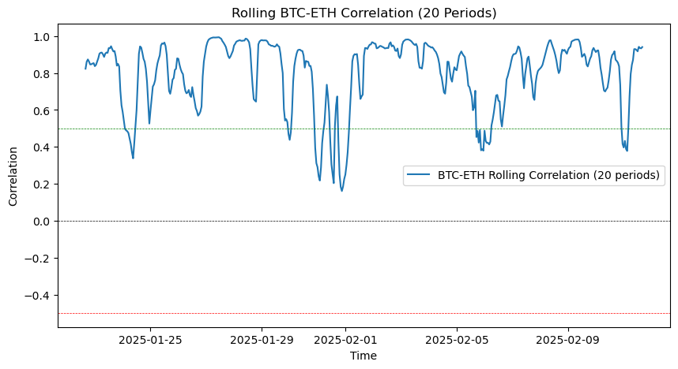

# Binance Cryptocurrency Correlation Analysis

This project fetches historical cryptocurrency price data from Binance and analyzes the correlation between Bitcoin (BTC) and Ethereum (ETH). The notebook retrieves market data, calculates correlations, and visualizes rolling correlations over time.

## Features

- Fetches historical price data from Binance for BTC/USDT and ETH/USDT pairs.
- Computes the Pearson correlation coefficient between BTC and ETH closing prices.
- Implements a rolling correlation analysis over a specified period.
- Plots the rolling correlation to visualize trends.

## Requirements

Ensure you have the following dependencies installed:

```bash
pip install -r requirements.txt
```

## Configuration

Create `config/myconfig.py` to store your Binance API credentials:

```bash
cp config/myconfig_template.py config/myconfig.py
```

```python
# config/myconfig.py
API_KEY = "your_api_key_here"
API_SECRET = "your_api_secret_here"
```

## Usage

Run the notebook `correlation.ipynb` to retrieve and analyze BTC and ETH price data.

### Parameters

- **interval**: The time frame for the data (e.g., `client.KLINE_INTERVAL_1HOUR` for hourly data).
- **lookback**: Number of historical periods to fetch (e.g., `500`).

## Output

- **Correlation coefficient** between BTC and ETH for the last `lookback` periods.
- **Rolling correlation plot**, showing how the relationship between BTC and ETH evolves over time.

## Example Output

```
BTC-ETH Correlation (last 500 periods): 0.8234
```



## License

This project is for educational purposes. Use at your own risk.

